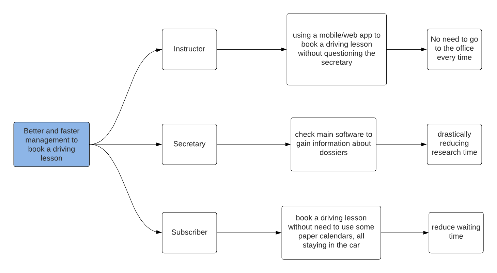

# Driving School Distributed Management Software (DSDMS)

L'obiettivo di questo progetto è creare un nuovo software, utile per le Scuole di Guida, e tutti gli aspetti di questo settore. 
In particolare:
- Gestire le Lezioni Pratiche di Guida;
- Gestire gli Esami Pratici e Teorici e tutti i constraints e quanto ne concerne;
- Gestire e storicizzare tutte le informazioni su Iscritti, Istruttori e Veicoli. 

Il progetto si basa sulla creazione di un sistema distribuito che implementa l'Architettura Microservizi e segue i principi di DevOps, come la Build Automation e la Continuous Integration.

Il Domain Driven Design è la metodologia che è stata seguita per sviluppare il progetto, insieme allo sviluppo guidato da Test di Accettazione per testare e convalidare i Requisiti forniti.

# Indice

- [Driving School Distributed Management Software (DSDMS)](#driving-school-distributed-management-software-dsdms)
- [Indice](#indice)
- [Obiettivi del progetto](#obiettivi-del-progetto)
  - [Richiesta committente](#richiesta-committente)
  - [Scenarios](#scenarios)
    - [Impact Map](#impact-map)
    - [Goal](#goal)
    - [Obiettivi](#obiettivi)
  - [Self-assessment policy](#self-assessment-policy)
- [Knowledge crunching](#knowledge-crunching)
  - [Domain story telling](#domain-story-telling)
- [Requisiti](#requisiti)
  - [Requisiti di Business](#requisiti-di-business)
  - [Requisiti utente](#requisiti-utente)
  - [Requisiti funzionali](#requisiti-funzionali)
    - [Dossier](#dossier)
    - [Exam](#exam)
    - [Driving](#driving)
  - [Requisiti non funzionali](#requisiti-non-funzionali)
  - [Requisiti implementativi](#requisiti-implementativi)
- [Ubiquitous Language](#ubiquitous-language)
- [Casi d'uso](#casi-duso)
- [Design](#design)
  - [Architettura generale](#architettura-generale)
  - [Tactical design](#tactical-design)
  - [Design dei microservizi](#design-dei-microservizi)
    - [ChannelsProvider e tipi di risposte](#channelsprovider-e-tipi-di-risposte)
  - [Organizzazione degli artefatti](#organizzazione-degli-artefatti)
- [Strategical Design](#strategical-design)
    - [Bounded context](#bounded-context)
  - [Bounded context canvas](#bounded-context-canvas)
    - [Dossier context](#dossier-context)
    - [Driving context](#driving-context)
    - [Exam context](#exam-context)
    - [Doctor context](#doctor-context)
- [DossierService tactical design](#dossierservice-tactical-design)
  - [Dossier domain service](#dossier-domain-service)
  - [Dossier](#dossier-1)
- [DoctorService tactical design](#doctorservice-tactical-design)
  - [Doctor domain service](#doctor-domain-service)
  - [Doctor bounded context communication](#doctor-bounded-context-communication)
  - [Sequence diagrams](#sequence-diagrams)
    - [Registrazione dei risultati](#registrazione-dei-risultati)
- [DrivingService tactical design](#drivingservice-tactical-design)
  - [Domain services of driving bounded context](#domain-services-of-driving-bounded-context)
    - [Bounded Context Communication](#bounded-context-communication)
  - [Sequence diagrams](#sequence-diagrams-1)
- [ExamService tactical design](#examservice-tactical-design)
  - [Provisional license domain service](#provisional-license-domain-service)
  - [Theoretical exam domain service](#theoretical-exam-domain-service)
  - [Sequence diagram](#sequence-diagram)
- [Dettagli implementativi](#dettagli-implementativi)
  - [Gradle](#gradle)
  - [Docker](#docker)
  - [Quality Assurance: Detekt e Ktlint](#quality-assurance-detekt-e-ktlint)
  - [K-Mongo e MongoDB](#k-mongo-e-mongodb)
  - [Vertx per WebClient e WebServer](#vertx-per-webclient-e-webserver)
  - [KotlinX per serializzare e deserializzare](#kotlinx-per-serializzare-e-deserializzare)
  - [Semantic Release per Automatic Versioning e Release](#semantic-release-per-automatic-versioning-e-release)
  - [Swagger e OpenAPI](#swagger-e-openapi)
  - [Cucumber](#cucumber)
- [Testing](#testing)
  - [Black-Box Test](#black-box-test)
    - [System Tester](#system-tester)
    - [Cucumber](#cucumber-1)
- [Unit Testing](#unit-testing)
- [Deployment](#deployment)
    - [Struttura multi-progetto](#struttura-multi-progetto)
    - [Task personalizzati](#task-personalizzati)
- [Continuous Integration](#continuous-integration)
  - [SwaggerHub publication](#swaggerhub-publication)
  - [Main workflow](#main-workflow)
  - [DRY in GitHub Actions](#dry-in-github-actions)
- [Quality Assurance](#quality-assurance)
- [Esempi di utilizzo](#esempi-di-utilizzo)
  - [Registrazione di una guida pratica](#registrazione-di-una-guida-pratica)
  - [Registrazione di un nuovo Dossier](#registrazione-di-un-nuovo-dossier)
- [Conclusioni](#conclusioni)
- [Retrospettiva](#retrospettiva)
- [Sviluppi Futuri](#sviluppi-futuri)


# Obiettivi del progetto
Durante il processo avvio del progetto, è stata organizzata una riunione di definizione degli obiettivi, in cui è stato utilizzato il metodo dell'***Impact Mapping*** per identificare gli attori principali coinvolti nel progetto e stabilire l'impatto che i *deliverables* del progetto devono avere, oltre al *business value* atteso.

Inoltre, si è completata l'organizzazione del processo di [Knowledge Crunching](/docs/report/Obiettivi/KnowledgeCrunching.md) che include le interviste con gli esperti del dominio, utili e necessarie per comprende a fondo le necessità del committente e le motivazioni per le quali il progetto è stato voluto.

##  Richiesta committente

"Sono il proprietario di due scuola guida. Dato l'avanzare dei tempi, richiedo un software di back-end che possa gestire i bisogni del settore nel quale opero. In particolare, ho già proceduto a richiedere la realizzazione del front-end.

Vi sono alcune complessità che il dominio di mia competenza porta con se, riguardanti la gestione delle guide, degli esami e di tutto ciò che concerne gli iscritti, che frequentano le scuola guida.
Lo scopo sarebbe quello di ottenere un software che possa consentire l'utilizzo distribuito nello spazio di determinate funzioni, un esempio fra tutti: uno dei requisiti sarebbe la prenotazione delle guide mediante ambiente esterno agli uffici.

Allo stato attuale, ogni processo è svolto in modo cartaceo o ultimamente con l'utilizzo di applicativi offline, che non ne consentono l'utilizzo efficace ed efficiente, anche in mobilità.
L'utilizzo di applicativi non unici e offline porta con se ulteriori limitazioni, riguardanti la correttezza e la consistenza dei dati tra i diversi uffici."

## Scenarios
### Impact Map

Successivamente alla richiesta precedentemente illustrata, il team di sviluppo ha deciso di produrre le seguenti impact map, per riuscire a comprendere maggiormente il problema e formulare domande significative nelle successive interviste.

Nelle impact map fornite, il primo livello indica il goal che vogliamo ottenere con la messa in atto del progetto concluso.
Ad esempio: miglior gestione (in termini di velocità e minor inconsistenza dei dati) per le guide.

Il secondo livello mostra gli attori coinvolti per il raggiungimento del goal preposti. Questi possono essere categorizzati in: utenti che interagiscono direttamente sul sistema (Istruttore o Segretario) e Iscritti (attori esterni che interagiscono con utenti del sistema).

Il livello successivo descrive l'impatto del progetto sulle azioni che gli attori andranno a effettuare.
L'ultimo livello individua il *business value* atteso dal raggiungimento degli obiettivi inizialmente individuati.

<div align="center">
      
      <p align="center" >[Fig 1] Impact map: gestione delle guide</p>
</div>

<div align="center">
      
      <p align="center" >[Fig 1] Impact map: utilizzo e coordinamento nell'utilizzo dei veicoli</p>
</div>

<div align="center">
      
      <p align="center" >[Fig 1] Impact map: gestione degli esami e relativi vincoli</p>
</div>


### Goal
Ricapitolando i goal individuati sono:
- **Migliorare la gestione di prenotazione delle guide**. Conseguente riduzione degli errori, aumento della velocità e precisione.
- **Migliorare la gestione del parco veicoli**: Rimozione della comunicazione diretta per individuare i veicoli disponibili, prevenzione dei casi in cui lo stesso veicolo è stato richiesto due volte per la stessa data e ora.
- **Verifica automatica dei vincoli di business**: Riduzione del tempo richiesto per le verifiche manuali, riduzione degli errori.

### Obiettivi
Per lo sviluppo dell'applicativo è stato scelto l'approccio Domain Driven Design (DDD) perché mette l'accento sull'analisi e la comprensione del dominio aziendale. Utilizzando l'approccio Domain Driven Design, è possibile modellare e rappresentare in modo più accurato concetti di business all'interno dell'applicativo, favorendo una migliore comprensione e una maggiore aderenza alle esigenze del committente.

Gli obbiettivi del progetto sono:

- Sviluppare un sistema back-end basato su microservizi
- Progettare i microservizi utilizzando DDD
- Documentare il dominio del sistema secondo DDD 


## Self-assessment policy
Al fine di garantire il rispetto dei requisiti e il corretto funzionamento delle API fornite dai microservizi, si è deciso di adottare le seguenti misure di quality assurance:
- Gli scenari d'uso descritti dal committente saranno integrati direttamente nel processo di testing attraverso l'utilizzo dell'approccio "Acceptance-Testing Driven Development".
- Saranno implementati processi di Continuous Integration per assicurare che il software venga testato in modo completo negli ambienti di esecuzione "puliti".
- Sarà effettuata una verifica automatica della qualità del codice mediante l'utilizzo di plugin esterni.


# Knowledge crunching

Dopo aver analizzato la richiesta che è stata effettuata e prodotto l’impact map si è tenuto la prima intervista con il committente, riportata di seguito.

<span style="color: #0077b6">**Analista**</span>: Nella sua richiesta, ci ha chiesto di sviluppare un backend da porre come base per digitalizzare i vostri processi aziendali, corretto ?

<span style="color: #79a355">**Cliente**</span>: Si, il front-end viene attualmente sviluppato da un team differente perciò abbiamo bisogno solo di back-end.

<span style="color: #0077b6">**Analista**</span>: Al momento attuale, i documenti come vengono gestiti ?

<span style="color: #79a355">**Cliente**</span>: Alla situazione attuale, disponiamo di un archivio cartaceo, contenente il fascicolo relativo a ciascun iscritto. Per la gestione delle guide, degli esami pratici e teorici e delle visite necessarie, ci avvaliamo di un calendario offline.

<span style="color: #0077b6">**Analista**</span>: Nell'archivio cartaceo, quali tipi di documenti vengono mantenuti per ogni studente ?

<span style="color: #79a355">**Cliente**</span>: Innanzitutto, identifichiamo gli utenti dell'autoscuola come Iscritti e non come studenti. Per ciascun iscritto manteniamo una pratica e un fascicolo.

<span style="color: #0077b6">**Analista**</span>: Cosa intendi con fascicolo ?

<span style="color: #79a355">**Cliente**</span>: Il fascicolo include la pratica e altri documenti a essa collegati, ad esempio il foglio rosa o il registro dell'esame teorico.

<span style="color: #0077b6">**Analista**</span>: E la pratica invece che cosa contiene ?

<span style="color: #79a355">**Cliente**</span>: La pratica include alcune informazioni di base relative all'iscritto, ad esempio Nome, Cognome, stato attuale di esami pratici e teorici.

<span style="color: #0077b6">**Analista**</span>: Parlando invece del calendario offline che attualmente utilizzate, mi pare di capire che sia un software, senza però collegamento in rete. Che informazioni vi vengono salvate ?

<span style="color: #79a355">**Cliente**</span>: Sul calendario, inseriamo la programmazione delle guide di ciascun iscritto, i giorni d'esame e la coda delle visite da effettuare con il dottore.

<span style="color: #0077b6">**Analista**</span>: Perciò quali processi sei interessato a digitalizzare ?

<span style="color: #79a355">**Cliente**</span>: Principalmente, vorrei digitalizzare e velocizzare le operazioni relative a:
- gestione delle guide
- gestione degli esami pratici, in termini d'iscrizioni, gestione dei tentativi
- gestione degli esami teorici, mantenendo se possibile un registro dell'esame teorico per ciascun iscritto
- gestione dei veicoli e degli istruttori, con i quali ciascuna guida è effettuata
- gestione maggiormente digitalizzata di pratiche e fascicoli, in modo da avere meno errori di consistenza e duplicazioni dei dati, a oggi purtroppo presenti


## Domain story telling
Per approfondire maggiormente la conoscenza del dominio, dei processi aziendali e di eventuali problemi riscontrati alla situazione attuale all'interno della azienda, si sono effettuati ulteriori colloqui con il cliente e gli esperti del dominio, maggiormente focalizzati sui processi precedentemente indicati.

Come strumento per la gestione e la rappresentazione grafica dei colloqui, si è deciso di utilizzare la strategia del Domain Storytelling, la quale prevede di lasciare raccontare agli esperti del dominio, come vengono svolte le differenti operazioni all'interno della Scuola Guida e cosa si vorrebbe ottenere come risultato, mentre i developers si occupano di catturare il racconto effettuato dall'esperto del dominio, tramite l'utilizzo del seguente linguaggio pittografico.

Per favorire le successive fasi di razionalizzazione e progettazione, i termini inseriti corrispondono all'[Ubiquitous Language](../Requisiti/UbiquitousLanguage.md) discusso con gli esperti del dominio.

I risultati emersi da tali analisi, sono mostrati di seguito.

**User Story: registrazione di un nuovo iscritto**

<span style="color: #0077b6">**Analista**</span>: Allo stato attuale, come viene gestita la registrazione di un nuovo iscritto ?

<span style="color: #79a355">**Esperto del dominio**</span>: Quando un utente entra e richiede l'iscrizione per una determinata patente, gli vengono richieste alcune informazioni di base e la copia di un documento identificativo, da registrare nella relativa pratica, successivamente inserita nell'archivio cartaceo.

<div align="center">
      
      <p align="center" id="fig1">[Fig 1] Domain story telling: gestione attuale per la registrazione di un nuovo iscritto</p>
</div>

**User Story: inserimento di una guida**

<span style="color: #0077b6">**Analista**</span>: Attualmente, una nuova guida come viene registrata ? Chi la può registrare ?

<span style="color: #79a355">**Esperto del dominio**</span>: Quando un iscritto richiede una successiva guida all'istruttore, quest'ultimo controlla la programmazione delle guide e comunica all'iscritto le possibili date. Lui potrà quindi confermare una data tra quelle proposte e sarà l'istruttore che provvederà alla registrazione manuale di un nuovo slot di guida, presso l'ufficio.

<span style="color: #0077b6">**Analista**</span>: A parte giorno e orario, quali altre informazioni vengono associate a uno slot di guida ?

<span style="color: #79a355">**Esperto del dominio**</span>: Ciascuna guida, è univocamente collegata a un singolo Iscritto, un Istruttore e un Veicolo (oltre alle informazioni da voi elencate).

<div align="center">
      
      <p align="center" id="fig2">[Fig 2] Domain story telling: registrazione di uno slot di guida</p>
</div>

**User Story: gestione attuale degli esami teorici**

<span style="color: #0077b6">**Analista**</span>: Mi descrivi lo scenario principale e più tipico per la registrazione di un iscritto all'appello di un esame teorico ?

<span style="color: #79a355">**Esperto del dominio**</span>: Il caso tipico, è quello in cui l'iscritto non è ancora idoneo all'esame, cioè la visita medica non è ancora stata effettuata, perciò bisogna innanzitutto scegliere la data e l'orario della visita.

<span style="color: #0077b6">**Analista**</span>: Come vengono definite le date delle visite ?

<span style="color: #79a355">**Esperto del dominio**</span>: Il personale medico per ciascuna scuola guida, mette a disposizione alcune giornate e fascie orarie standard e predefinite. Per la mia esperienza di lavoro nel settore, queste informazioni non vengono mai modificate.

<span style="color: #0077b6">**Analista**</span>: Ok. Dopo aver fissato la visita medica, come si procede ?

<span style="color: #79a355">**Esperto del dominio**</span>: Il personale medico, successivamente alla visita, ne comunica il risultato. A questo punto viene assegnato alla pratica dell'iscritto un registro, per la gestione dei tentativi d'esame. L'iscritto viene quindi registrato al prossimo appello d'esame disponibile.

<div align="center">
      
      <p align="center" id="fig3">[Fig 3] Domain story telling: gestione di un esame teorico</p>
</div>

**User Story: gestione attuale degli esami pratici**

<span style="color: #0077b6">**Analista**</span>: Quando un iscritto manifesta l'intenzione di effettuare un esame pratico, come si procede ?

<span style="color: #79a355">**Esperto del dominio**</span>: Come prima cosa verifichiamo due fattori principali:
- la programmazione passata delle guide per verificarne il numero esatto (almeno 12)
- il possedimento di un foglio rosa valido

Verificati questi fattori, si ricerca il primo slot di guida disponibile per effettuare l'esame pratico, e lo si propone all'iscritto.

<span style="color: #0077b6">**Analista**</span>: In precedenza hai parlato di slot di guida in riferimento a guide pratiche "standard". Qual è la differenza tra i due ?

<span style="color: #79a355">**Esperto del dominio**</span>: La principale differenza riguarda il fatto che gli slot relativi a esami pratici devono essere etichettati come tali e possono essere inseriti solo in determinati giorni da noi impostati. In tali giornate si hanno a disposizione uno o più esaminatori, che conducano gli esami.

<span style="color: #0077b6">**Analista**</span>: Se l'iscritto accetta le date a lui precedentemente proposte, come si procede ?

<span style="color: #79a355">**Esperto del dominio**</span>: Viene inserito nella programmazione un nuovo slot di guida, relativo all'esame in questione.

<div align="center">
      
      <p align="center" id="fig4">[Fig 4] Domain story telling: gestione di un esame pratico</p>
</div>


# Requisiti
Questa sezione della relazione, viene dedicata alla descrizione approfondita dei requisiti di progetto, raccolti durante le fasi di Knowledge Crunching.

Questo ha permesso di determinare nel dettaglio, le funzionalità necessarie e volute all'interno del progetto, evitando ambiguità nella discussione con il cliente, appoggiandosi sull'Ubiquitous Language.

## Requisiti di Business
I requisiti di business specificano le caratteristiche che il sistema dovrà possedere per essere corretto, definendone gli obiettivi di alto livello.

I requisiti di business previsti dal Driving School Distributed Management Software, che sono stati individuati, sono i seguenti:
- digitalizzare i processi di business attualmente cartacei;
- ridurre i tempi di ogni operazione;
- consentire l'utilizzo di alcuni applicativi (es. prenotazione di guide pratiche) da remoto;

## Requisiti utente
I requisiti utente esprimono i bisogni degli utenti e descrivono quali sono le azioni che l’utente deve poter effettuare interagendo con il sistema.

Dalla precedente analisi del dominio che è stata effettuata possiamo rilevare i seguenti requisiti utente:
- registrare un nuovo Dossier;
- leggere e aggiornare un Dossier esistente;
- leggere e verificare la validità di Provisional License e Theoretical Exam Pass;
- registrare un nuovo Driving Slot (relativo a una Driving Lesson o a un Practical Exam);
- eliminare un Driving Slot esistente;
- registrare un Dossier valido ed esistente, all'interno di un Exam Appeal;
- aggiornare o creare Theoretical Exam Pass o Provisional License;
- registrare e leggere Doctor Slot;
- registrare il risultato della visita da Dottore
- definire e leggere Practical Exam Day;

## Requisiti funzionali
I requisiti funzionali riguardano le funzionalità che il sistema deve mettere a disposizione all’utente. Per la loro definizione è necessario basarsi sui requisiti utente estratti in precedenza.

Sono stati identificati i requisiti funzionali e sono stati suddivisi in tre categorie: Dossier, Exam, Driving

### Dossier 
- dopo la seconda scadenza del Provisional License (limitatamente a un singolo Dossier), il dossier deve essere invalidato;
- un dossier invalidato non deve essere utilizzabile su alcun processo effettuato dall'utente, ma viene mantenuto col solo scopo di condurre analisi future;
- un subscriber può avere più dossier a lui collegati, ma solamente uno valido in un dato momento;
- deve essere possibile aggiornare Theoretical Exam e Practical Exam Status.

Optional: un dossier può essere invalidato manualmente, tramite una chiamata ad API

### Exam 
- ciascun dossier può avere un'unica Provisional License in un dato momento;
- per poter inserire un Dossier in un Exam Appeal è necessario un Theoretical Exam Pass valido;
- l'ottenimento di un Theoretical Exam Pass, avviene conseguentemente alla visita col Dottore;
- ciascun Theoretical Exam Pass permette l'iscrizione a massimo due Exam Appeal, nell'arco di sei mesi di validità;
- per consentire l'inserimento di un Driving Slot (relativo a Driving Lessons o Practical Exams), è necessario un Provisional License valido;
- ciascun Provisional License permette l'iscrizione a massimo tre Practical Exam, entro un anno di validità;
- il Provisional license viene fornito dopo il successo del Theoretical exam.

### Driving
- ogni Driving Slot, in una fascia oraria è univocamente associato a un Dossier, un Instructor e un Vehicle;
- ciascun Driving Slot può rappresentare un Practical Exam o una Driving Lesson;
- ciascun Dossier può riservare un Driving slot alla volta;
- per poter inserire un Driving Slot, è necessario verificare la validità della Provisional License;
- è possibile inserire un Driving Slot relativo a Practical Exam, solo in un Practical Exam Day.


## Requisiti non funzionali
I requisiti non funzionali riguardano le funzionalità che il sistema non deve necessariamente possedere per fare in modo che sia funzionante e corretto.

I requisiti non funzionali che sono stati individuati sono i seguenti:
- il software deve essere eseguibile sul sistema operativo Linux, e supportare  Java Runtime Environment versione 11, 16, 17 e 18;
- il sistema deve essere integrabile con front-end esterni, utilizzando le API messe a disposizione;

## Requisiti implementativi
I requisiti d'implementazione vincolano l’intera fase di realizzazione del sistema, ad esempio richiedendo l’uso di uno specifico linguaggio di programmazione e/o di uno specifico tool software.

I requisiti implementativi previsti dal Driving School Distributed Management Software, che sono stati indicati dal cliente, sono i seguenti:
- le componenti software del sistema saranno programmate in linguaggio Kotlin;
- il software deve essere basato sull'architettura di base dei Microservizi;
- le API (Application Programming Interface) fornite da ciascun microservizio, dovranno essere di tipo REST;
- il deployment di ciascun microservizio, dovrà essere possibile mediante l'utilizzo di Container Docker;
- il testing del sistema dovrà avvenire mediante Acceptance Testing;


# Ubiquitous Language
Durante le fasi iniziali di sviluppo, per favorire la comunicazione tra esperti del dominio (cliente e stakeholders) e il team di sviluppo, l'obiettivo è stato quello di accordarsi sul significato dei termini utilizzati, evitando ambiguità e incomprensioni.

Questo ha permesso di ottenere il seguente dizionario dei termini (successivamente utilizzati all'interno di tutte le fasi di sviluppo):

| Termine                            | Traduzione            | Definizione                                                                                                                                 |
|------------------------------------|-----------------------|---------------------------------------------------------------------------------------------------------------------------------------------|
| Iscritto                           | Subscriber            | Una persona che si iscrive in autoscuola. Viene associato ad uno o più dossier, di cui solamente uno valido in un certo momento.            |
| Istruttore                         | Instructor            | Un impiegato dell'autoscuola. Gestisce Driving Lessons con i Subscriber.                                                                    |
| Veicolo                            | Vehicle               | Mezzo con cui un Instructor esegue Driving Lesson.                                                                                          |
| Esame Teorico                      | Theoretical Exam      | Esame teorico effettuato da un Subscriber.                                                                                                  |
| Esame Pratico                      | Practical Exam        | Esame ottenuto da un Subscriber, a bordo di un Vehicle insieme ad un Instructor.                                                            |
| Guida                              | Driving Lesson        | Una lezione di guida. Concordata tra Subscriber e Instructor.                                                                               |
| Dottore                            | Doctor                | Registra visite mediche a ciascun Subscriber, necessaria per conseguire il Theoretical Exam. Consente di ottenere un Theoretical Exam Pass. |
| Segretario                         | Secretary             | Impiegato/a interno/a dell'autoscuola. Lavora solo in ufficio o a contatto con il pubblico.                                                 |
| Slot di guida                      | Driving Slot          | Fascia oraria occupata ad una Driving Lesson o da un Practical Exam. Univocamente associato con un Subscriber, un Instructor ed un Vehicle. |
| Visita                             | Doctor Slot           | Fascia oraria occupata per eseguire la visita col dottore, da parte di un Subscriber.                                                       |
| Pratica                            | Dossier               | Insieme di informazioni riguardanti un singolo Subscriber.                                                                                  |
| Foglio rosa                        | Provisional License   | Documento assegnato ad un Subscriber dopo il passaggio del Theoretical Exam, necessario per iscriversi al Practical Exam.                   |
| Appello d'esame                    | Exam appeal           | Un appello per un Theoretical Exam, associato a più Dossier.                                                                                |
| Status d'esame                     | Exam status           | Una sezione del Dossier che documenta i progressi negli esami.                                                                              |
| Registro esame teorico             | Theoretical exam pass | Assegnato ad un Subscriber che abbia completato la visita col dottore, necessario per conseguire il Theoretical Exam.                       |
| Giorno d'esame pratico             | Practical Exam Day    | Identificativo dei giorni in cui è possibile inserire dei Driving Slots per effettuare Practical Exams.                                     |
| Guida pratica regolare             | Regular driving slot  | Identificativo delle guide pratiche regolari (che non rappresentano un esame pratico)                                                       |
| Guida d'esame                      | Exam driving slot     | Identificativo delle guide pratiche, rappresentanti un esame pratico di guida                                                               |
| Evento di approvazione del dottore | Doctor approval event | Un evento quando il dottore approva lo stato del salute del iscritto permettendo la creazione del registro esame teorico                    |  
 | Evento d'esame                     | Exam event            | Un evento d'esame che provoca una modifica della pratica                                                                                    |  


# Casi d'uso

A partire da ciò che emerso dalle precedenti fasi di analisi del dominio, sono stati dedotti quattro casi d'uso principali, in base alle necessità richieste dal cliente e dagli esperti del dominio.

Per favorire le successive fasi di razionalizzazione e progettazione, i termini inseriti corrispondo all'[Ubiquitous Language](UbiquitousLanguage.md) discusso precedentemente.

<div align="center">
      
      <p align="center" >[Fig 1] Diagramma dei casi d'uso: gestione del Dossier</p>
</div>

Il diagramma visualizzato in <a href="#fig1"> Figura 1 </a>, mostra il caso d'uso relativo alla gestione del Dossier. Un Dossier contiene tutte le informazioni di base (ad esempio nominativo, codice fiscale, numero ti fogli rosa) di un Iscritto.
L'attore che svolge le operazioni è identificato come Segretario: tutte le operazioni visibili sono infatti svolte dopo esplicite richieste degli iscritti.

In particolare la procedura di **Update Exam Status of Dossier** specifica aggiornamento sul completamento di esami pratici/teorici. In caso invalidazione di due fogli rossa dossier deve essere invalidato

<div align="center">
      
      <p align="center">[Fig 2] Diagramma dei casi d'uso: gestione delle guide</p>
</div>

Il secondo diagramma mostrato in <a href="#fig2"> Figura 2 </a>, invece, mostra l'ipotetica gestione delle guide.
Ciascuna guida è univocamente collegata a un Iscritto, un Istruttore, un Veicolo e una fascia oraria.
L'attore in questione è l'Istruttore: con l'utilizzo del software messo a disposizione, l'obiettivo è infatti quello di velocizzare le operazioni d'inserimento degli slot di guida, evitando processi maggiormente prolungati e costosi.
Come evidenziato dal diagramma l'inserimento di uno slot, comporta alcuni *include* (determinate operazioni richieste per l'esistenza del caso d'uso principale):
- verificare la validità del foglio rosa
- verificare la disponibilità d'Istruttore, Veicolo e Dossier
- ricercare un giorno e fascia oraria che soddisfi i vincoli imposti dal concetto di slot

<div align="center">
      
      <p align="center">[Fig 3] Diagramma dei casi d'uso: gestione degli esami teorici </p>
</div>

Il diagramma visibile in <a href="#fig3"> Figura 3 </a> evidenzia la gestione degli esami teorici: anche in questo caso l'attore presente è il Segretario, che esegue le operazioni visibili:
- legge gli slot disponibili per la visita, inserendo l'iscritto nel primo slot libero
- completata la visita e avendo quindi a disposizione un registro per l'esame teorico, l'iscritto sarà registrato in un appello d'esame
  
Anche in questo caso, la registrazione all'appello d'esame necessita di un controllo sulla validità del registro d'esame dell'iscritto (come evidenziato dall'*include*)

<div align="center">
      
      <p align="center">[Fig 4] Diagramma dei casi d'uso: gestione degli esami pratici</p>
</div>

L'ultimo diagramma presente, <a href="#fig4"> Figura 4 </a>, mette in risalto la gestione degli esami pratici, da parte del Segretario:
- registra un nuovo foglio rossa
- registra uno slot di guida, relativo a un esame pratico. L'*include* evidenzia alcune operazioni necessarie per l'esistenza di questo caso d'uso: verifica sul giorno d'esame, sulla validità del foglio rosa e sul minimo numero di guide effettuate necessarie
- aggiorna il numero di tentativi dell'esame pratico riferiti al foglio rosa dell'iscritto
- seleziona il giorno d'esame tra quelli disponibili


# Design
## Architettura generale
Tenendo conto del requisito d'implementazione che richiede di basare l'architettura del sistema su microservizi, sono stati definiti i seguenti elementi principali:
- Il client si connette a uno o più microservizi attraverso API REST.;
- Alcuni microservizi comunicano tra loro tramite API REST;
- Ogni microservizio dispone del proprio database MongoDB.


<p align="center">[Fig 1] Diagramma astratto relativo all'architettura del sistema in esame</p>

Durante la fase di Strategical Design, sono stati definiti quattro bounded context che verranno mappati su quattro microservizi: DoctorService, DossierService, ExamService e DrivingService. Ognuno di essi ha a disposizione il proprio database MongoDB.

Il componente di testing chiamato SystemTester è responsabile di simulare un client al fine di verificare il corretto funzionamento del sistema. Le comunicazioni tra i microservizi sono rappresentate nella  <a href="#deploymentImpl">[Fig 2]</a>

<div id="deploymentImpl"></div>


<p align="center">[Fig 2] Diagramma del deployment dell'intero sistema</p>

## Tactical design
L'architettura dei microservizi è stata progettata seguendo i principi di *[Clean Architecture](https://betterprogramming.pub/the-clean-architecture-beginners-guide-e4b7058c1165)* che permettono lo sviluppo di applicazioni Loosely-Coupled ovvero con forte disaccoppiamento dell’applicazione dall’infrastruttura.

In particolare sono stati individuati quattro layer: 
- **Frameworks & Drivers** layer: Implementa il punto d'ingresso utilizzato dal client del servizio per effettuare delle richieste utilizzando API REST esposte da ciascun microservizio, pertanto questo livello definisce gli endpoint REST supportati dal servizio insieme alla relativa interfaccia;
- **Interface Adapters** layer: Questo livello è composta da due tipi di componenti principali: gli adattatori d'input e gli adattatori di output;
  - *Gli adattatori d'input* sono responsabili della gestione delle comunicazioni proveniente dal mondo esterno, come le interfacce utente o i punti di accesso delle API, e della conversione di tale input in un formato comprensibile per la logica di business dell'applicazione. Essi ricevono l'input dell'utente e lo traducono in una forma che può essere elaborata dall'applicazione;
  - *Gli adattatori di output* gestiscono la comunicazione dall'applicazione verso il mondo esterno. Sono responsabili di convertire le richieste del modello di business in un formato riconoscibile dal Frameworks & Drivers layer. Gli adattatori di output interagiscono con il database e servizi esterni;
- **Application** layer o (Application Business Rules): Contiene una raccolta di tutti i casi d’uso del servizio in questione e le relative azioni per ciascuno di essi;
- **Domain** layer o (Enterprise Business Rules): Rappresenta il livello centrale di ogni servizio in cui sono definite le regole di business del contesto. Contiene la definizione di eventi, entity, value objects.


<p align="center">[Fig 3] Clean Architecture nel contesto dei microservizi realizzati </p>

Per la realizzazione dei microservizi, sono state seguite le linee guida del [tactical design](https://thedomaindrivendesign.io/what-is-tactical-design/), cercando quindi d'individuare tra i concetti del dominio quali avessero il ruolo di entità, evento, value objects o domain service.

## Design dei microservizi

Il diagramma in figura <a href="#class_architecture">[Fig 4]</a> descrive le relazioni tra diverse componenti dell'architettura:

- ***Server***: responsabile per l'interazione con i client o altri sistemi esterni. Il server riceve le richieste in arrivo, tramite le API REST, e le inoltra al gestore delle rotte (*RouteHandlers*);

- ***RouteHandlers***: questa componente si occupa di gestire le richieste ricevute dal server e d'indirizzarle ai metodi del modello appropriati;

- ***Model***: questa componente contiene *Domain Services* che rappresentano e implementano la logica del modello di business;

- ***DomainService***: ogni servizio del dominio rappresentano una parte della logica del business del bounded context. Inoltre, i servizi del dominio possono dipendere da:
  - ***Repository***: questa componente rappresenta un'astrazione per l'accesso ai dati persistenti.
  - ***ChannelsProvider***: questa componente consente l'ottenimento dei canali di comunicazione con altri microservizi. (Vedi: <a href="#class_channels">[Fig 5]</a>)
  
<div id="class_architecture"></div>


<p align="center">[Fig 4] Struttura generale dei microservizi. </p>

### ChannelsProvider e tipi di risposte
***ChannelsProvider*** è una factory che produce e fornisce l'accesso agli adattatori di output, che permettono la comunicazione con gli altri microservizi. Ogni Channel è rappresentato da una interfaccia che fornisce i metodi coerenti con il modello di business, astraendo dall'aspetto tecnologico necessario per la comunicazione. 

Esempio dell'utilizzo: <a href="#class_channels">[Fig 5]</a>. Si può notare che i metodi dei canali restituiscono un'enumerazione *DomainResponseStatus* che permette da un lato la comprensione delle risposte provenienti da un altro dominio (es. DOSSIER_INVALID, VALID_DOSSIER_ALREADY_EXISTS ecc.), dall'altro la trasformazione dei problemi tecnologici (es. Errori di comunicazione) in un formato comprensibile dal dominio (es. DELETE_ERROR, UPDATE_ERROR).

Stesso approccio viene utilizzato anche per la *Repository* che tipicamente restituisce *RepositoryResponseStatus*, successivamente convertito in *DomainResponseStatus* tramite una mappa di conversione.
*RouteHandler* a sua volta ha una tabella per convertire le risposte del domino nei codici HTTP.

<div id="class_channels"></div>


<p align="center">[Fig 5] Esempio di comunicazione tra microservizi. In particolare sono mostrati i canali di comunicazione disponibili per DoctorService. </p>


## Organizzazione degli artefatti
I microservizi sono composti da quattro package principali:
- *channels* contiene gli artefatti responsabili per la comunicazione con altri microservizi;
- *database* package contenente gli artefatti che permettono l'accesso al database tramite Repository pattern;
- *handlers* raggruppa gli artefatti che gestiscono le rotte delle API REST;
- *model* contiene gli artefatti del modello del dominio.


<p align="center">[Fig 6] Diagramma dei package comune per tutti microservizi</p>


# Strategical Design

Per evolvere il dominio a questo punto si è pensato di procedere tramite Strategic Design. Questo tipo di studio individua, a partire dai casi d’uso, i diversi sotto-domini che compongono il dominio principale.

Abbiamo quindi individuato, quattro sotto domini all'interno del dominio in esame:
- Dossier: sotto dominio che mantiene le informazioni di base degli utenti e le procedure per la relativa gestione
- Exam: sotto dominio per la gestione degli esami pratici e teorici e tutto ciò che ne concerne (es. registro d'esame teorico e foglio rosa)
- Driving: sotto dominio per la gestione delle guide e gli esami pratici effettuate da ciascun iscritto

I sotto domini sopra elencati, sono stati inoltre classificati come:
- Generic domain: rappresenta alcune funzioni comuni a più sotto domini
- Core domain: rappresenta una o più funzioni primarie, all'interno del dominio principale
- Supporting domain: raggruppa determinate funzioni necessarie ma non fondamentali per il dominio principale

Avendo chiaro le informazioni di cui sopra, i sotto domini precedentemente individuati sono stati classificati come segue: Dossier di tipo Generic, Driving di tipo Core ed Exam di tipo Support.

### Bounded context

Per tre sotto domini rilevati sono stati progettati quattro bounded context:
- *Dossier context* che appartiene a Dossier subdomain
- *Driving context* che appartiene a Driving subdomain
- *Exam context* e *Doctor context* che appartengono a Exam subdomain 

<div align="center">
      
      <p align="center" >[Fig 1] Context map del sistema</p>
</div>

## Bounded context canvas

Il successivo passaggio di progettazione, dettato dal DDD, è stata la progettazione dei Bounded Contexts all'interno dei domini in esame.
Ciascun Bounded Context modella una porzione del dominio, definendone i confini in modo chiaro e non ambiguo, con l'obiettivo di gestirne le relative entrate e uscite in termini d'informazioni e azioni eseguibili.

Per ciascun contesto individuato, di seguito si propone una rappresentazione testuale dei Bounded Context Canvas.


### Dossier context

**Description**: Gestione di tutte le informazione riguardanti un iscritto, gestisce invalidità delle pratiche

**Strategic classification**: 
- Domain: Generic
- Business Model: compliance enforcer
- Evolution: commodity

**Business Decisions**: 
- Dopo la scadenza del primo foglio rosa, il numero di tentativi d'esame possibili, deve essere azzerato
- La pratica deve poter essere annullata dopo la scadenza del secondo foglio rosa
- Una pratica invalida, non può essere modificata ma solo visualizzata a fini di storicizzazione
- Non può essere registrato un iscritto con meno di 16 anni
  
**Inbound Communications**:
- Register a new dossier (Client → a command)
- Update Practical Exam Status (Client → a command)
- Notification that Provisional license is not valid anymore ( Exam context → an event)
- Notification that Theoretical or Practical exam has been passed ( Exam context → an event)
- Read Dossier (Client, Exam context → a query)

### Driving context
**Description**: Consente la gestione delle guide, acquisendo l’informazione relative a veicoli, istruttori 

**Strategic classification**:
- Domain: Core
- Business Model: revenue generator
- Evolution: commodity

**Business Decisions**:
- In un certo giorno e orario, uno slot di guida è univocamente collegato a:
    - Un istruttore
    - Una pratica
    - Un veicolo
- La durata di ciascun slot di guida è 30 minuti, iniziando a intervalli regolari di tempo
- Un iscritto può prenotare uno slot di guida alla volta. Dopo il completamento, può prenotarne uno nuovo.
- All’inserimento di uno slot di guida, verificare la validità del provisional license
- Esame pratico è uno slot di guida che ha prerequisiti aggiuntivi:
  - Può essere registrato solo in Practical exam day
  - L'iscritto deve aver effettuato 12 o più lezioni pratici
  
**Inbound Communications**:
- Register a new Practical Driving lesson or exam (Client → a command)
- Delete Practical Driving Lessons (Client → a command)
- Read Practical Driving slots (Exam context, Client → a query)
- Register a practical exam day (Client → a command)
- Visualize practical exam days (Client → a command)
    
**Outbound Communications**:
- Check provisional license validity (Exam context → A query)

### Exam context
**Description**: Consente la gestione di esame teorico e pratico, insieme a tutto ciò che ne concerne (registro d'esame teorico e foglio rosa).

**Strategic classification**: 
- Domain: Support
- Business Model: compliance enforcer
- Evolution: custom built

**Business Decisions**: 
- Ciascun foglio rosa deve essere associato univocamente a una pratica e viceversa
- Se una pratica è invalida, non deve essere possibile utilizzarla relativamente alla gestione degli esami
- Esame teorico:
    - Necessario un registro d'esame teorico valido, con le seguenti caratteristiche:
        - consente due tentativi d'esame entro sei mesi
        - viene fornito dopo la visita medica
        - dopo la scadenza, necessaria una nuova visita medica (Pratica rimane valida)
- Un foglio rosa valido, con le seguenti caratteristiche:
        - consente tre tentativi d'esame entro 12 mesi
        - viene fornito dopo il superamento dell'esame teorico insieme alla notifica a Dossier Context
        - Dopo la prima scadenza, è necessario conseguire l'esame teorico e notificare Dossier Context
        - Dopo la seconda scadenza, Dossier context viene notificato. Il foglio rossa deve essere cancellato

**Inbound Communications**:
- Register theoretical exam appeal day (Client → A command)
- Read list of future theoretical exam appeals (Client -> A query)
- Read theoretical exam appeal information (Client -> A query)
- Register a dossier in Exam Appeal (Client → A command)
- Creation of a Theoretical Exam pass (Doctor context → an event)
- Create Provisional License (Client -> a command)
- Read Provisional License info (Client -> a query)
- Check validity of Provisional License (Driving context → A query)

**Outbound Communications**:
- Notify start validity or invalidity of the Provisional license (Dossier context → an event)
- Check validity of dossier (Dossier context →  a query)

### Doctor context

**Description**: consente la gestione di tutto ciò che concerne la visita, necessaria agli iscritti per poter conseguire l'esame teorico.

**Strategic classification**: 
- Domain: Support
- Business Model: compliance enforcer
- Evolution: custom built
  
**Business Decisions**: 
- Se una pratica è invalida, non deve essere possibile utilizzarla per la prenotazione delle visite
- Il giorno in cui le visite sono effettuabili è stabilito da entità esterne al sistema e non può essere modificato (ogni Giovedì dalle 18 alle 19:30)
- Ciascuna visita ha una durata di 15 minuti (max sei iscritti)

**Inbound Communications**:
- Read Doctor slots (Client → A Query)
- Add Doctor slots (Client → A command)
- Register doctor visit result (Client -> A command)
  
**Outbound Communications**:
- Comunicate that visit has been done (Exam context -> A command)
- Check validity of dossier (Dossier context →  a query)


# DossierService tactical design

- **Entities**: Dossier
- **Value objects**:  ExamStatus, SubscriberDocuments
- **Events**: ExamEvent
- **Specifications**: SubscriberControls


## Dossier domain service
**DossierService** nel suo *Model* contiene il domain service *DossierDomainService* che ha i compiti: 
- Registrare le nuove pratiche degli iscritti e verificare che i dati forniti dal client sono conformi con il modello del dominio.
- Fornire le pratiche in caso delle richiese
- Reagire all'*ExamEvent* gestendo la logica di aggiornamento del macro stato degli esami (*ExamStatus") che include invalidazione della pratica in caso se il secondo foglio rossa era invalidato.

Il modello dominio ha una singola entità *Dossier* che contiene l'informazione della pratica. Per crearla il client deve inviare un value object *SubscriberDocuments* che viene validato tramite le specifiche *SubscriberControls*


<p align="center">[Fig 1] Diagramma del modello di dominio di DossierService</p>

## Dossier

Ogni *Dossier* contiene un value object *ExamStatus* che contiene due campi:
- *theoreticalExamState* che mostra se iscritto ha passato l'esame teorico.
- *practicalExamState* che mostra se iscritto ha passato l'esame teorico e se ha gìà avuto invalidazioni del foglio rossa. Questo campo non contiene il numero di fallimenti per ogni singolo foglio rossa, lasciando questa responsabilità a *ProvisionalLicenseHolder* del ExamContext

*ExamStatus* incapsula un insieme d'invarianti che impediscono la creazione degli stati inconsistenti nel modello del dominio (esempio: l'esame pratico è passato mentre l'esame teorico non è passato).


<p align="center">[Fig 2] Diagramma che descrive la classe ExamStatus che appartiene alla classe Dossier </p>


# DoctorService tactical design

- **Entities**: DoctorSlot
- **Value objects**: DoctorResult
- **Events**: DoctorApprovalEvent
  
<!-- <a href="#domain">figura</a> -->


## Doctor domain service

Il dominio in esame, si occupa della gestione di tutto ciò che concerne il subdomain relativo alle attività del Doctor, all'interno della scuola guida. Le funzionalità gestite dal servizio, riguardano in particolar modo la gestione dei _Doctor Slot_.

Ciascun Doctor Slot, rappresenta la visita con il dottore per un Iscritto, in un determinato giorno e in una determinata data, concordata con il Segretario al momento della prenotazione. Ulteriori constraints relativi alle visite, riguardano:
- la possibilità di prenotare una visita solo nelle date proposte;
- la durata massima prefissata, di ciascuna visita, pari a quindici minuti.

I metodi che il microservizio mette quindi a disposizione, riguardando nel dettaglio le seguenti funzionalità:
- inserimento di un nuovo doctor slot;
- richiesta dei doctor slot occupati in una certa data;
- eliminazione di un doctor slot;
- salvataggio del risultato di una visita, per un certo iscritto.
Le informazioni manipolate dal servizio, sono tutte inserite e storicizzate nel db, dai doctor slot ai doctor results.

All'interno del domain service in questione, il Doctor Slot è stato identificato come _Entity_, in quanto è distinguibile da altri doctor slots, mediante l'Id della pratica dell'iscritto a cui la visita fa riferimento.
Mentre _Doctor Results_, rappresenta un Value Object, quindi riutilizzabile su più oggetti, e non strettamente o direttamente identificabile, se non mediante l'id del dossier. Però, possono essere presenti sul Db più doctor results relativamente a un singolo DossierId, relativi a molteplici visite effettuate.

<div id="class-domain" align="center"></div>


<p align="center">[Fig 1] Diagramma della struttura del Doctor bounded context</p>

## Doctor bounded context communication

Per completare, alcune delle attività di cui sopra, è stato necessario inserire la comunicazione di questo servizio, con altri servizi esterni. Ad esempio per verificare la validità di un dossier o notificare il termine di una visita a Exam Service.

In particolar modo, la comunicazione con Exam Service è necessaria per poter permettere all'iscritto di conseguire l'esame teorico ed eventualmente successivamente l'esame pratico.

La comunicazione avviene mediante un evento: _Doctor Approval Event_, che rappresenta il termine (con successo) della visita di un iscritto, che può quindi procedere nel suo percorso di formazione all'interno della scuola guida.

<div id="class-communication"></div>


<p align="center">[Fig 2] Diagramma che mostra come Doctor bounded context comunica con DossierContext e </p>

## Sequence diagrams

Di seguito alcuni diagrammi di sequenza che descrivono le principali operazioni, che il servizio in esame offre e implementa.

Il primo mostra la sequenza di azioni necessarie per prenotare la visita dal dottore per un certo iscritto. Nel caso in cui l'assunzione inserita non sia verificata, verrà ritornato all'utente un messaggio di errore indicando che la data e l'orario desiderati non sono disponibili. Un ulteriore controllo avviene al passaggio successivo, in cui si verifica che il dossier Id fornito per la prenotazione esista e sia valido. Anche in questo caso, se il check non restituisce un feedback positivo, viene restituito all'utente un differente messaggio d'errore.

<div id="sequence_dossier"></div>


<p align="center">[Fig 3] Diagramma di sequenza che mostra un scenario di successo della prenotazione di una visita dal dottore</p>


### Registrazione dei risultati 

Il diagramma di sequenza in figura, mostra la sequenza di azioni eseguite dopo la registrazione del risultato positivo di una visita, per un certo iscritto.
La prima verifica effettuata, riguarda il check sul risultato della visita (deve essere VALID per poter proseguire).
Se viene restituito risultato positivo si procede con il salvataggio del Doctor Result corrispondente sul db.
Successivamente si procede alla notifica della visita mediante l'evento _Doctor Approval Event_, a Exam Service, che procede alla creazione del Theoretical exam Pass, un registro che tiene il conto dei tentativi d'esame teorico effettuati.

<div id="sequence_exam"></div>


<p align="center">[Fig 4] Diagramma di sequenza dove dopo registrazione di un risultato positivo della visita dal dottore viene avviata la creazione di registro esame teorico </p>


# DrivingService tactical design
- **Entities**: DrivingSlot, Instructor, Vehicle
- **Value objects**: DrivingSlotBooking, DrivingSlotsRequest, LicensePlate, PracticalExamDay

## Domain services of driving bounded context

Il dominio in esame, si occupa della gestione di tutto ciò che concerne il subdomain relativo alle attività principali di una scuola guida, le guide pratiche con iscritti e istruttori.

In particolar modo, ciascuna guida pratica è identificata come Driving Slot, e richiede per la relativa prenotazione una data ed eventualmente un istruttore "preferito", da ricercare e inserire nella prenotazione.
Ciascun Driving Slot, dispone inoltre di diversi constraints relativi al dominio. Quali ad esempio:
- possibilità di prenotarne solo uno per ciascun iscritto;
- durata prefissata di 30 minuti;
- duplice tipologia: esame pratico o guida pratica;

Nel caso in cui il driving slot, rappresenti un esame pratico, si aggiungono ulteriori limitazioni necessarie per rispettare il dominio che il progetto va a supportare, ad esempio saranno necessari dodici driving slot pregressi per un iscritto che voglia procedere con un esame pratico.

Più in particolare, il microservizio Driving, offre i seguenti metodi per manipolare i driving slots:
- salvataggio di un nuovo driving slot;
- richiesta dei driving slot attualmente occupati in una certa data ed eventualmente per un certo istruttore;
- eliminazione di un driving slot prenotato;

Come accennato precedentemente, un driving slot può anche riferirsi a un esame pratico. Per questo motivo si è deciso d'inserire nel servizio in esame, alcuni metodi aggiuntivi per la registrazione e la ricerca dei giorni in cui sarà quindi possibile inserire determinate guide d'esame.

Approfondendo ulteriormente, si procede con una breve spiegazione delle scelte effettuate per la rappresentazione e categorizzazione degli elementi di questo servizio:
- License Plate, identifica esattamente un veicolo ed è stato quindi rappresentato come _Value Object_. Mentre un veicolo, univocamente accessibile mediante license plate, viene identificato come _Entity_;
- Instructor, univocamente identificabile mediante l'id, quindi identificato come _Entity_;
- Driving Slot, univocamente identificabile mediante l'id a lui assegnato, identificato come _Entity_;
- Practical exam Day, rappresenta un giorno in cui guide d'esame sono inseribili. Non è direttamente identificabile, perciò viene categorizzato come _Value Object_;
- Driving Slots Booking e Driving Slots request, sono documenti inviati dall'utente durante le fasi di prenotazione di un nuovo driving slot, identificati anch'essi come _Value Objects_.


<p align="center">[Fig 1] Diagramma di domain services del Driving bounded context</p>
### Bounded Context Communication

Per consentire l'implementazione di alcune delle funzionalità accennate sopra, è stato necessario inserire un meccanismo che consentisse a Driving Service, la comunicazione con Exam Service: Exam Service Channel.

Quest'ultimo fornisce una connessione mediante Web Client al servizio Exam, necessaria per verificare la validità (in una data fornita) del foglio rosa univocamente collegato a un dossier id.

Il foglio rosa è infatti un prerequisito necessario per procedere alla prenotazione di qualsiasi tipologia di Driving Slot. Viene caratterizzato da una validità e da un numero di tentativi d'esame effettuabili prefissato in base a quelle che sono le regole del dominio.


<p align="center">[Fig 2] Diagramma della struttura del Driving bounded context</p>

## Sequence diagrams

Il diagramma di sequenza in figura, consente di descrivere nel dettaglio la procedura necessaria alla registrazione di una nuova Guida Pratica, che non rappresenta perciò un esame pratico.
La prima operazione effettuata successivamente alla richiesta di prenotazione, è la verifica dei requisiti necessari, quali ad esempio la validità degli orari/giorni forniti, dei dati forniti per l'istruttore.
Se questo viene validato, si procede con il controllo del foglio rosa. Questa verifica avviene mediante Exam Service, verso il quale otteniamo collegamento mediante Exam Service Channel, precedentemente introdotto.
Se anche la seconda verifica, si procede con successo all'inserimento del Driving Slot nel DB.

Ipotizzando la prenotazione di una guida d'esame, si aggiungerebbero alcuni constraints e conseguentemente ulteriori verifiche da completare con successo(ad esempio sulla corretta selezione di un giorno d'esame), prima di poter inserire il driving slot sul database.


<p align="center">[Fig 3] Diagramma di sequenza dell'operazione di registrazione di una nuova guida pratica</p>


# ExamService tactical design
- **Entities**: TheoreticalExamAppeal, TheoreticalExamPass, ProvisionalLicense
- **Value objects**: ProvisionalLicenseHolder, TheoreticalExamAppealUpdate
- **Events**: DoctorApprovalEvent, ExamEvent


## Provisional license domain service

Exam Service ricopre alcune delle parti fondamentali del dominio che il progetto vuole andare a supportare, in particolare: la gestione degli esami teorici e del foglio rosa.
La gestione del foglio rosa (aka Provisional License), viene astratta dall'oggetto Provisional License Holder. Quest'ultimo funge infatti da "incapsulatore" per un singolo foglio rosa.

Un oggetto di questo tipo si è reso necessario, dati i constraints relativi a esso che il dominio e il committente ci impongono di rispettare. Tra cui:
- Numero massimo di tentativi d'esame pratico pari a tre;
- Entro un termine di dodici mesi di validità.
Questo implica che preventivamente all'iscrizione a un tentativo d'esame pratico, verifichiamo la validità del foglio rosa e successivamente aggiorniamo il Provisional License Holder, tenendo conto del tentativo effettuato.
    
Per fornire le funzionalità di cui sopra, sono inseriti i seguenti metodi per:
- la registrazione di una nuova Provisional License;
- la richiesta di un particolare Provisional License Holder, univocamente identificato dal Dossier Id a cui il relativo foglio rosa è univocamente associato;
- un check sulla validità della Provisional License di un Iscritto, in un dato momento;
- la gestione dei tentativi d'esame pratico;
- la registrazione e aggiornamento dello stato d'esame: quest'ultimo avviene mediante l'evento _Exam Event_, con il quale comunichiamo a Dossier Service (mediante Dossier Service Channel), il passaggio dell'esame pratico.

Dossier Service Channel, introdotto precedentemente, fornisce una connessione mediante VertX WebClient al service Dossier, mediante la quale effettuare le operazioni di cui sopra.

Provisional License Holder, viene identificato come Value Object, in quanto non identificabile univocamente ma solo tramite Provisional License in esso contenuto, a sua volta categorizzato come Entity.
Provisional License è infatti univoco all'interno del sistema, e univocamente associato a un dossierId.


<p align="center">[Fig 1] Diagramma di domain service che gestisce le operazioni che riguardano il foglio rossa </p>

## Theoretical exam domain service

Ciascun esame teorico, richiede alcuni constraints:
- un theoretical exam pass valido
- la scelta di un appello a cui iscriversi tra quelli disponibili

Un theoretical exam pass, rappresenta un registro d'esame teorico, utilizzato come modello astratto per semplificare la gestione dei tentativi d'esame entro il termine prefissato di validità della visita con il dottore. Il pass viene infatti consegnato solo successivamente alla visita con il dottore, con risultato positivo.

Il Servizio in esame, successivamente alla ricezione di un _Doctor Approval Event_, crea un Theoretical Exam Pass per il dossier Id fornito mediante il messaggio, inizializzato a default. Successivamente il servizio, fornisce alcuni _Exam Event_, per monitorare e aggiornare Dossier Service, in merito allo stato d'esame di un Iscritto. In particolare le tipologie di evento disponibili, sono le seguenti:
- Provisional License Invalidation, con cui segnalare il raggiungimento del limite di tentativi d'esame pratico o della validità temporale del foglio rosa;
- Theoretical Exam Passed o Practical Exam Passed, con cui segnalare il conseguimento del rispettivo esame;
Lo stato d'esame viene quindi mantenuto e aggiornato all'interno di Dossier Service.

Per fornire le funzionalità di cui sopra, sono forniti i seguenti metodi:
- per la gestione degli appelli d'esame teorico (inserimento, richiesta, aggiornamento). L'aggiornamento si rende necessario dal fatto che ciascun Dossier Id, deve essere inserito nella coda dell'appello d'esame a cui viene iscritto.
- per la creazione, lettura e cancellazione in un Theoretical Exam Pass.

Ciascun Theoretical Exam Pass è direttamente e univocamente identificabile dal DossierId a cui viene assegnato, quindi identificato come entità all'interno dell'analisi del dominio. Ugualmente, ogni appello d'esame teorico è univoco nella data in cui viene inserito, e perciò identificato anch'esso come entità.
Mentre ciascun oggetto di tipo Theoretical Exam Appeal Update, utilizzato per l'aggiornamento della lista d'iscritti a uno specifico appello d'esame teorico, non è identificabile univocamente e perciò identificato come Value Objects, all'interno del dominio in esame.


<p align="center">[Fig 2] Diagramma di domain service che copre gli aspetti che riguardano l'esame teorico</p>

## Sequence diagram

Il diagramma di sequenza in figura, mostra le azioni effettuate per l'operazione di registrazione del conseguimento dell'esame pratico (da parte di un Iscritto).
Come visibile dal diagramma dopo il conseguimento dell'esame, la Provisional License relativa all'iscritto viene eliminata e rimossa dal sistema.

Per ciascuna operazione l'iter iniziale è il medesimo: aggiornamento della Provisional License, e successivamente check del dossier relativo ed esecuzione di ulteriori azioni se necessarie.
Una sequenza simile viene inoltre seguita per la gestione del Theoretical Exam Pass, con riferimento però all'esame teorico, all'interno del dominio in esame.


<p align="center">[Fig 3] Diagramma di sequenza che descrive l'operazione di registrazione del risultato positivo del esame pratico</p>


# Dettagli implementativi

In questa sezione inseriamo le tecnologie che sono state utilizzate all'interno del progetto. Data la natura e architettura similare dei microservizi, non sono presenti tecnologie specifiche per ciascun microservizio.

Di seguito le tecnologie utilizzate.

## Gradle

Per favorire il testing, la creazione e la distribuzione del software, si è deciso di utilizzare Gradle come strumento di build automation. Il processo di building è quindi semplificato dall'utilizzo di tale strumento, che mette a disposizione differenti plugin, dipendenze e librerie utilizzate nel progetto. In particolare mediante Gradle si è incluso nel progetto diversi tool per la quality assurance (successivamente descritti) o il necessario per l'utilizzo della libreria KotlinX.

Inoltre per favorire ulteriormente l'organizzazione e lo sviluppo del software e delle dipendenze/plugin di Gradle, si è deciso di utilizzare Toml. Quest'ultimo consente di raggruppare gli elementi prima indicati in un unico file, separato da ciascun microservizio. Le dipendenze/plugin sono poi importate dal file Toml in ciascun Build.gralde.

## Docker

Per favorire una corretta esecuzione del progetto indipendentemente dal sistema operativo e dalle risorse del sistema, si è deciso di utilizzare Docker come ambiente di esecuzione. Questo ha permesso e permette di eseguire ciascun Microservizio in modo indipendente, insieme a MongoDb e ad altri servizi utili allo sviluppo e all'esecuzione del software.

In particolare ciascun microservizio dispone di un Docker file, che ne definisce per l'esecuzione alcuni parametri, argomenti e variabili d'ambiente fondamentali (tra cui l'URI di mongodb o la porta in cui il microservizio sarà istanziato su localhost), e il comando per il caricamento del singolo Jar, all'interno del microservizio in questione.

Infine, nella directory generale, è presente un file Docker Compose, utilizzato per l'effettivo avvio del progetto.

## Quality Assurance: Detekt e Ktlint

Durante e in particolare al termine del progetto, per verificare e mantenere sotto controllo la qualità del codice inserita nel progetto, si sono utilizzati due tool: Detekt e Ktlint

Ktlint è uno strumento open-source sviluppato per formattare e controllare la qualità del codice scritto in Kotlin. Utilizza una serie di regole di formattazione e di stile codice per garantire la coerenza e la leggibilità del codice. In sostanza, Ktlint è uno strumento di analisi statica del codice che può essere utilizzato da sviluppatori Kotlin per aiutarli a scrivere un codice più pulito e ben organizzato.

Kotlin Detekt è uno strumento di analisi statica del codice sorgente Kotlin, che aiuta gli sviluppatori a identificare potenziali problemi di codice, bug, vulnerabilità di sicurezza e altre violazioni delle best practice di sviluppo. Detekt è progettato per integrarsi facilmente con diversi ambienti di sviluppo, come IntelliJ ed Eclipse, e può essere eseguito come parte del processo di compilazione del progetto o come plugin Gradle.

## K-Mongo e MongoDB

MongoDB è un sistema di gestione di database non relazionale (NoSQL) che consente di archiviare e gestire grandi volumi di dati non strutturati, in formato Json. È progettato per essere scalabile, flessibile e ad alte prestazioni, fornendo alta manipolazione mediante query e diverse funzionalità di aggregazione dei dati.

KMongo è una libreria di MongoDB per Kotlin che fornisce un'API intuitiva e facile da usare per interagire con MongoDB, sul linguaggio di programmazione Kotlin, utilizzato nel progetto in questione. KMongo fornisce inoltre supporto all'aggregazione dei dati, alle operazioni effettuabili su MongoDB e alle Kotlin Coroutines, fornendo metodi Suspend per l'utilizzo delle funzioni fornite da MongoDB, in modo asincrono.

## Vertx per WebClient e WebServer

VertX WebClient e WebServer sono due componenti della piattaforma Vert.x. Un framework per la creazione e la gestione di applicazioni web-server, che include tra le altre, i componenti Web Client e Web Server.

Vert.x WebClient è una libreria client per effettuare chiamate HTTP/HTTPS a server remoti. È basato sulla Reactive Streams API e utilizza un modello asincrono di programmazione. Tale funzionalità è utilizzata, nelle comunicazioni tra System tester e i microservizi o nelle chiamate ad API solo tra microservizi.

Vert.x WebServer, invece, è un server per la creazione di applicazioni web, con l'utilizzo di un modello asincrono di programmazione. Inoltre, supporta la gestione delle richieste HTTP/HTTPS e la creazione di API REST. Ciascun MicroServizio utilizza l'implementazione di VertX WebServer: Coroutine Verticle.

Questo ha consentito l'utilizzo da un lato delle funzionalità offerte dal WebServer di VertX (es. Gestione delle routes), e dall'altro ha permesso di usufruire dei vantaggi nell'utilizzo delle Kotlin Coroutines come modello asincrono su Kotlin. In particolare in tutti i microservizi si sono utilizzati i metodi Suspend, una tipologia di Coroutines che permettono a ciascuna funzione di essere sospesa e ripresa in qualsiasi momento, favorendo meccanismi asincroni di programmazione.

## KotlinX per serializzare e deserializzare

KotlinX è un insieme di librerie Kotlin che forniscono supporto per la serializzazione e la deserializzazione di oggetti in diversi formati. Le librerie forniscono un'API per la manipolazione dei dati in modo efficiente, consentendo l'utilizzo di Data Class, fornendo al codice un grado di semplicità e leggibilità maggiore, anche per sviluppi futuri.
Tutte queste funzionalità sono risultate particolarmente utili nel progetto in esame, dove la serializzazione e la deserializzazione sono spesso necessarie per comunicare tra microservizi e client. In generale, KotlinX semplifica la gestione dei dati distribuiti, migliorando l'efficienza e la sicurezza del codice.

## Semantic Release per Automatic Versioning e Release

Semantic Release è un framework che gestisce la versione del software e la sua pubblicazione in modo automatico, seguendo le linee guida del semantic release. Utilizza il concetto di Conventional Commits per standardizzare le descrizioni dei commit e sfrutta gli strumenti di continuous integration per automatizzare il rilascio di nuove versioni in base ai cambiamenti effettuati nel codice sorgente. In questo modo, Semantic Release garantisce un processo di rilascio del software più sicuro e affidabile.

Nel progetto questo tool è stato utilizzato per effettuare le release del software sulla piattaforma GitHub.

## Swagger e OpenAPI

Swagger è uno strumento open-source per la documentazione delle API in formato JSON o YAML. Consente di creare una documentazione completa delle API, definendone i dati d'input e output, gli endpoint e le operazioni che la API può eseguire.

Nel progetto è stato utilizzato per documentare tutte le API, che ciascun microservizio mette a disposizione, comprendendo ogni tipo di response code, payload e message, che viene possibile ricevere.
Inoltre per favorire le procedure di test delle API in futuro, per il cliente e utenti finali, ogni rotta a disposizione è disponibile per il testing.

Tutta la documentazione è stata inoltre pubblicata e resa pubblica presso SwaggerHub, disponibile e consultabile al seguente [link](https://app.swaggerhub.com/apis/DenGuzawr22/DSDMS/latest)

## Cucumber

Cucumber è un framework che semplifica la creazione di Acceptance Test, mediante l'utilizzo di un linguaggio chiaro e non ambiguo, Gherkin, interpretato da Scenari e Step.
L'intero progetto è stato eseguito con l'obiettivo dell'Acceptance Test Driven Development, quindi focalizzato sui test di accettazione.
Tali test, sono focalizzati sull'utente finale del sistema e sui requisiti funzionali e non funzionali imposti al progetto.

L'utilizzo di questo Framework ha consentito l'inclusione del cliente nella definizione e implementazione delle procedure di testing, consentendo a entrambe le parti, team e cliente, di trarne vantaggio. Da un lato il cliente si rendeva conto del grado di complessità e di completezza del progetto (relativamente ai requisiti imposti), dall'altro il team ha potuto incrementare non poco la conoscenza sul dominio in esame, traendo spunto e informazione dal cliente.

Per maggiori informazioni sull'utilizzo di questa tecnologia all'interno del progetto, consultare la sezione [Testing](Testing/Testing.md) 


# Testing

Per verificare il corretto funzionamento del sistema e l'efficienza dei servizi forniti al cliente,
si è proceduto a testare le diverse componenti del sistema, mediante Acceptance Testing Driven Development.
Il testing avviene su due fronti:
- test locali, all'interno di ciascun microservice;
- black-box test (a scatola chiusa), con cui viene verificato il progetto, mediante il client SystemTester.
  
Nelle successive sezioni verranno descritti in maggiore dettaglio i test realizzati e le motivazioni che vanno a supportare le scelte implementative effettuate.

Non verranno invece riportate, verifiche sul coverage del progetto fornito, in quanto solo una piccola porzione del codice dei microservice viene testata mediante test locali. Un client "dummy", viene utilizzato per eseguire acceptance test "a scatola chiusa", forniti al committente, verificando il soddisfacimento dei requisiti funzionali e non funzionali imposti.


## Black-Box Test
Come anticipato, questa tipologia di test nasce dalla necessità di verificare le API messe a disposizione dai singoli microservice
a "scatola-chiusa", senza quindi tener conto delle logiche interne.
Per eseguire questi test, si è deciso d'implementare un client "dummy": System Tester, sul quale
come framework di Testing viene adottato Cucumber.

### System Tester
System Tester rappresenta un client "dummy", inserito nel progetto per verificare il funzionamento
delle API dei singoli microservice, a "Scatola chiusa".
Ciascuna API e ciascun microservice viene testata con l'utilizzo del framework Cucumber, mediante scenari e step espressi in un linguaggio facilmente comprensibile anche per l'utente finale.
Questo consente di verificare il soddisfacimento dei requisiti imposti dal committente del software, verificando
ciascuna risposta ottenuta successivamente a ogni interrogazione.

Per ciascuna risposta, si verificano alcuni parametri fondamentali:
- status code: rappresenta il codice HTTP che viene restituito (codice 200 per OK, codice 400 per BAD REQUEST sono spesso utilizzati);
- body: contiene un payload ottenuto dalla richiesta (un Dossier, un Driving Slot) o un messaggio di errore/di conferma.

### Cucumber
Cucumber è un framework che consente l'implementazione di Acceptance Testing. Viene utilizzato per la scrittura di test funzionali, utilizzando Gherkin, come linguaggio per la definizione degli scenari con linguaggio naturale e ben comprensibile, anche dal committente.
L'utilizzo di questa metodologia di test, ha anche consentito di creare una connessione tra il team di sviluppo e l'utente, che riesce a comprendere con facilità lo scopo e il funzionamento dei test di accettazione forniti, potendolo inserire efficacemente nel processo di sviluppo.

I test di accettazione, eseguiti mediante cucumber, consentono di verificare il soddisfacimento di requisiti funzionali e non funzionali, specificati dal cliente o dagli utenti finali. Essi rappresentano infatti, l'ultima fase del ciclo di vita del software, eseguiti solo successivamente ai test locali precedentemente descritti.

Di seguito un esempio dell'utilizzo di Cucumber e del linguaggio Gherkin per l'esecuzione di Acceptance Testing.
In particolare viene verificata l'API per la registrazione di un Iscritto su DossierService, con differenti set d'informazioni, senza tener conto del codice "di basso livello", ma solamente verificando le risposte ottenute.

Nel primo scenario, vengono fornite informazioni corrette, la creazione viene correttamente eseguita, restituendo l'Id del dossier creato.
Verificando l'Id fornito, otteniamo nel Body il Dossier completo in formato Json, dal quale possiamo visualizziamo che exam status è stato correttamente inizializzato.
Nel secondo scenario, forniamo a DossierService dei dati invalidi, viene quindi restituito per ogni set di valori, una differente tipologia di errore.

```
Feature: Registration subscriber documents and reading dossier information
  Scenario Outline: subscriber information's are correct
    When I register subscriber's documents information: <name>,<surname>,<birthdate>,<fiscal_code>
    Then I received an id of registered dossier
    When I search dossier by received id
    Then I find <name>,<surname>,<birthdate>,<fiscal_code> of registered dossier
    And It has not done both practical and theoretical exams

    Examples: basic information
        | name | surname | birthdate | fiscal_code |
        | Riccardo | Bacca | 1999-03-07 | BCCRCR99C07C573X |

    Scenario Outline: The subscriber documents information has invalid values
        When I try to register invalid subscriber information: <name>,<surname>,<birthdate>,<fiscal_code>
        Then I get <error_type> error type

    Examples: invalid subscriber information
        | name | surname | birthdate | fiscal_code | error_type |
        | Riccardo | Bacca | 1999-03-07 | BCCRCR99C07C573X | VALID_DOSSIER_ALREADY_EXISTS |
        | Ricca    | Bacca | 2015-03-07 | BCCRCR99C07C573K | AGE_NOT_SUFFICIENT           |
        | b        | 123   | 1999-03-07 | BCCRCR99C07C573L | NAME_SURNAME_NOT_STRING      |
```


# Unit Testing

Per verificare il corretto funzionamento del sistema e l'efficienza dei servizi forniti al cliente,
si è proceduto a testare le diverse componenti del sistema, mediante Acceptance Testing Driven Development.
Il testing avviene su due fronti:
- test locali, all'interno di ciascun microservice;
- black-box test (a scatola chiusa), con cui viene verificato il progetto, mediante il client SystemTester.
  
Nelle successive sezioni verranno descritti in maggiore dettaglio i test realizzati e le motivazioni che vanno a supportare le scelte implementative effettuate.

Non verranno invece riportate, verifiche sul coverage del progetto fornito, in quanto solo una piccola porzione del codice dei microservice viene testata mediante test locali. Un client "dummy", viene utilizzato per eseguire acceptance test "a scatola chiusa", forniti al committente, verificando il soddisfacimento dei requisiti funzionali e non funzionali imposti.


# Deployment

Questa sezione, vuole analizzare nel dettaglio le procedure utilizzate nel progetto per il deployment del sistema a microservizi, sviluppato.

In particolare si è deciso di seguire tecniche DevOps per la build automation e le automatic release, insieme all'utilizzo di Gradle come tool principale.
Il tutto risulta virtualizzato mediante container docker, che ne consentono e facilitano l'esecuzione su diversi ambienti.

### Struttura multi-progetto
Il progetto è stato sviluppato come un gradle multi progetto composto da cinque sotto-progetti. Quattro di questi sono dedicati a ciascun bounded context individuato, mentre un ultimo denominato *SystemTester* è stato creato per simulare un client e testare l'intero sistema di microservizi. 
Questo approccio presenta diversi vantaggi:
- Innanzitutto, consente di ottenere una struttura modulare e separata, fondamentale per lo sviluppo dei microservizi;
- Ogni bounded context viene gestito in modo indipendente, consentendo agli sviluppatori di concentrarsi sulle funzionalità specifiche di ciascun microservizio.

Inoltre, grazie all'approccio multi-project, è possibile condividere il codice di configurazione di Gradle tra i vari sotto-progetti e importare alcune classi su "SystemTester", semplificando il processo di testing. Questa condivisione del codice di configurazione aiuta a ridurre la duplicazione e a mantenere una coerenza nelle impostazioni di build e dipendenze.

### Task personalizzati
Per ogni sotto-progetto sono stati creati dei task personalizzati e sono stati inseriti all’interno dei relativi file `build.gradle.kts`.

In particolare per ciascuno sono stati configurati o creati vari task, tra cui:
- `ShadowJar` che permette la generazione di un jar eseguibile. La configurazione:
  - Specifica la Main class;
  - Assegna un nome personalizzato che può includere la versione del sistema;
  - Specifica la cartella di destinazione.
- `createJavadoc` permette la generazione degli artefatti assieme alla documentazione Javadoc.

# Continuous Integration
Particolare attenzione è stata posta nell’individuazione di misure per assicurare la qualità del codice. Grazie alle GitHub Actions sono stati predisposti dei workflow per garantire la Continuous Integration e la Quality Assurance.

Sono stati creati due workflow:
- **SwaggerHub publication** composto da un singolo job che pubblica la documentazione OpenApi su [SwaggerHub](https://swagger.io/tools/swaggerhub/)
- **Main workflow** ha il compito di creare gli artefatti (in alcuni casi pubblicandoli) ed effettuare il testing.
  
## SwaggerHub publication
La documentazione delle Api REST viene fatta utilizzando le specifiche [OpenAPI](https://swagger.io/specification/). Per uno sviluppo e una manutenzione semplificata di questa documentazione si è deciso di dividere il file principale in più file. Il processo di unione dei file e la pubblicazione automatica richiede automatizzazione.

In particolare per avere sempre online la documentazione più recente è stato creato il workflow *SwaggerHub publication* che automaticamente aggiorna la versione [latest](https://app.swaggerhub.com/apis/DenGuzawr22/DSDMS/latest) della documentazione.
Il workflow è composto da:
1. Generazione di un unico file.yaml a partire dai frammenti;
2. Validazione della documentazione che ne permette la rilevazione e la correzione di errori;
3. Pubblicazione del file assemblato su SwaggerHub.
    
## Main workflow
Il workflow principale è composta da tre job:
1. **BuildAndTest**, fondamentale nel processo di CI. Include i seguenti step:
   - Setup di kotlin e di java;
   - Building di tutti sotto-progetti, questo step include esecuzione dei test locali e la verifica di QA;
   - Deployment dei microservizi nei container docker insieme con un container di MongoDB utilizzando docker-compose;
   - Esecuzione dei test di *SystemTester*.
2. **Release**: se il workflow è stato scatenato nel main branch sarà partito il processo di release degli artefatti su GitHub. Per la release viene utilizzato [semantic-release](https://github.com/semantic-release/semantic-release). Quest'ultimo consente la generazione automatica di una versione del [Semantic Versioning](https://semver.org).
3. **SwaggerHubPublish** questo job ripete la funzionalità di job del workflow descritto in precedenza. Con due differenze:
   1. Le API non vengono più aggiornati ma viene creata una nuova versione;
   2. La versione di release del job precedente viene utilizzata per nominare la versione delle API.
   
## DRY in GitHub Actions
In due workflow dal progetto vengono utilizzati due job molto simili, per questo motivo si è creato un Action riusabile per ridurre la duplicazione del codice aumentandone la semplicità di lettura e manutenibilità futura.
Questa Action riceve i seguenti parametri:
- `source-file` il percorso al entry file dei frammenti della documentazione openapi;
- `version` la versione delle API che devono essere create o aggiornate;
- `type` l'operazione, che può essere "create" o "update";
- `token` token d'accesso di SwaggerHub.

# Quality Assurance
Per garantire la qualità del codice e dello sviluppo, sono stati utilizzati i seguenti Gradle Plugin:
- **Gradle pre-commit Git Hooks**: Questo plugin crea un Git Hook che impedisce di effettuare un commit se non viene rispettato il formato [Conventional commits](https://www.conventionalcommits.org/en/v1.0.0/). I "Conventional Commits" sono una convenzione per scrivere messaggi di commit strutturati in un formato specifico, che facilita l'automazione delle versioni e la generazione delle note di release. 
- **Ktlint**: Questo plugin permette di mantenere uno stile uniforme nel codice Kotlin. Ktlint applica regole di formattazione del codice predefinite o personalizzate all'interno del progetto. Assicurarsi che tutto il codice Kotlin sia formattato in modo coerente facilita la leggibilità del codice e promuove buone pratiche di sviluppo.
- **Detect**: Questo plugin consente di eseguire un'analisi statica del codice per identificare e prevenire diversi tipi di potenziali problemi. Ad esempio, il plugin può individuare vulnerabilità nella sicurezza del codice, dipendenze non conformi, violazioni delle best practice di sviluppo e altre problematiche simili.


# Esempi di utilizzo

Il progetto sviluppato, si è posto l'obiettivo di sviluppare un sistema basato su Microservizi, che andasse a digitalizzare le funzionalità e i processi messi in atto da una Scuola Guida.
L'obiettivo è stato quindi il solo sviluppo del back-end ti tale applicativo, in modo da fornire tutte le API necessarie allo sviluppo di un applicativo di front-end correlato.

In particolare, gli ambiti che sono stati tenuti in considerazione, successivamente ad alcuni colloqui con il committente sono i seguenti:
- Gestione degli esami pratici e teorici, relative prenotazioni e registrazione dei risultati, visita con il dottore;
- Gestione dei documenti di ciascun Iscritto: foglio rosa, conteggio guide, conteggio esami teorici;
- Gestione dei veicoli e delle guide pratiche;
- Gestione degli iscritti e delle relative informazioni personali.

Di seguito viene riportato un esempio di utilizzo delle API messe a disposizione, per il successivo sviluppo di un'interfaccia grafica.

## Registrazione di una guida pratica

Innanzitutto è necessario connettersi al microservizio *Driving Service*, istanziato sulla porta 8010 di localhost.
Per la connessione viene utilizzato WebClient, relativo alla libreria Vertx, utilizzata all'interno del progetto.

```kotlin        
val options: WebClientOptions = WebClientOptions()
    .setDefaultPort(8010)
    .setDefaultHost("driving_host")

return WebClient.create(Vertx.vertx(), options)
```

Avendo eseguito la connessione, possiamo procedere con l'utilizzo delle API messe a disposizione dal microservizio voluto, visualizzabili mediante [Documentazione OpenAPI](https://app.swaggerhub.com/apis/DenGuzawr22/DSDMS/latest).

L'obiettivo dell'esempio riportato è quello di registrare una guida pratica su strada, svolto come mostrato.

```kotlin
val request = client
    .post("/drivingSlots")
    .sendBuffer(
        Buffer.buffer(
            Json.encodeToString(
                DrivingSlotBooking(
                    LocalDate.parse(date),
                    LocalTime.parse(time),
                    instructorId,
                    dossierId,
                    DrivingSlotType.ORDINARY,
                    LicensePlate(vehicle),
                ),
            )
        ),
    )
```

L'invio delle informazioni avviene sempre mediante formati standard e riconoscibili visualizzati mediante schemi Json. Conseguentemente viene utilizzato un Buffer per effettuare encoding del modello Json necessario. Per ciascuna chiamata di tipo Post o Put, i rispettivi schemi Json, sono visibile all'interno di ciascun microservizio o nella documentazione OpenAPI.

Infine riceveremo una risposta positiva o negativa dal rispettivo microservizio, gestibile e visualizzabile mediante i seguenti comandi.
Le tipologie di conferma o di errore ricevibili, sono anch'esse mostrate nella relativa documentazione OpenAPI, al link precedentemente inserito.

```kotlin
val response = waitResult(request)

statusMessage = response.body().toString()
statusCode = response.statusCode()
```

## Registrazione di un nuovo Dossier

Di seguito viene mostrata la procedura per la registrazione di un nuovo Dossier nel sistema.

Apertura della connessione al microservizio *Dossier Service*, istanziato sulla porta 8000 di Localhost.

```kotlin        
val options: WebClientOptions = WebClientOptions()
    .setDefaultPort(8000)
    .setDefaultHost("dossier_host")

return WebClient.create(Vertx.vertx(), options)
```

Come nell'esempio precedente, visualizzando la documentazione OpenAPI, procediamo con la chiamata alla rotta messa a disposizione per l'operazione simulata.

```Kotlin
val request = client
    .post("/dossiers")
    .sendBuffer(
        Buffer.buffer(
            Json.encodeToString(
                SubscriberDocuments(name, surname, LocalDate.parse(birthdate), fiscal_code)
            )
        )
    )
```

Attendiamo una risposta dal server e gestiamo/visualizziamo il contenuto.
Anche in questo caso, dalla documentazione OpenAPI è possibile esaminare le risposte ottenibili da parte del server.

```kotlin
val response = waitResult(request)

statusMessage = response.body().toString()
statusCode = response.statusCode()
```


# Conclusioni
In questo capitolo conclusivo verranno illustrati i possibili sviluppi e utilizzi futuri dei microservizi forniti, insieme a una breve retrospettiva sullo sviluppo del progetto.

# Retrospettiva

Il progetto è stato portato a termine con risultati soddisfacenti. Applicare per la prima volta il Domain Driven Design è stata una sfida che ha permesso al team di maturare e ampliare il proprio set di skill nella progettazione e gestione di un progetto complesso, fornendo nuovi utili strumenti per affrontare al meglio progetti futuri.

In particolar modo, il focus sullo studio e la conoscenza del dominio hanno richiesto di adattare il nostro pensiero da ingegneri del software a un campo diverso da quello informatico; la sessione di knowledge crunching con l’esperto del dominio è stata un’occasione di crescita impagabile che ci ha forzati ad adattarci a nuove terminologie e ragionamenti per poi tradurli in linee guida per la nostra progettazione.

Vi è stata anche una crescita sotto il punto di vista delle competenze tecnologiche, in quanto in questo progetto sono stati utilizzati molti strumenti diversi che ci hanno fatto assaporare la filosofia DevOps.

In conclusione, il progetto ha permesso l'utilizzo di alcune tecnologie e tecniche di programmazione prima non conosciute, o conosciute solo in teoria, quali ad esempio il Domain Driven Design, l'architettura dei microservizi e lo sviluppo basato su Acceptance Test Driven Development, che ha consentito di mettere al centro dello sviluppo il cliente, che ha cosi avuto un ruolo centrale nella definizione dei test di progetto.


# Sviluppi Futuri

Il progetto sviluppato rappresenta un insieme di API, a disposizione di scuole guida, per l'informatizzazione delle funzioni svolte.
Per questo motivo l'espansione, gli sviluppi e utilizzi futuri di questo progetto, ne rappresentano una porzione fondamentale, di cui si è tenuto conto già dalle prime fasi progettuali.

Per quanto concerne il dominio affrontato, si è deciso con il committente di gestire solamente quanto è necessario per patenti B, lasciando quindi spazio ad allargamenti futuri verso corsi e patenti professionali.

Un esempio su tutti, con minimo sforzo implementativo, sarebbe possibile introdurre gli elementi per l'informatizzazione delle procedure necessarie alle patenti Moto. Questo in quanto molti degli elementi necessari sono già presenti, e i constraints temporali sono i medesimi.

Infine, mediante l'utilizzo dell'interfaccia grafica (che il committente aveva già assegnato), sarà possibile un utilizzo user friendly e affidabile delle API messe a disposizione.
Ad esempio per l'utilizzo del sistema di prenotazione dei Driving Slot, sono disponibili API con cui ottenere gli slot attualmente occupati. Diviene possibile "completare" con tali slot un calendario digitale, lasciando spazi liberi e quindi prenotabili per nuovi Driving Slot.
Si otterrà così un sistema estremamente semplice e intuitivo nel suo utilizzo.

Un ulteriore aspetto non tenuto in considerazione durante la progettazione e lo sviluppo (per mancanza di risorse temporali e non), è l'autenticazione delle Routes e l'eventuale aggiunta di un Gateway. Questo aumenterebbe non poco la sicurezza del sistema in uso e consentirebbe di esporre all'utente finale le sole Routes a lui indirizzate (non visualizzando routes infra-servizi).

Inoltre, determinato codice e classi di utilità sono duplicate tra microservizi (scelta effettuata per mantenere separazione tra essi). Sarebbe possibile inserire una libreria intermedia, che renda disponibile in modo comune tale codice ai microservizi che ne richiedono l'utilizzo, riducendo duplicazione e mantenendo semplicità nel codice utilizzato.
