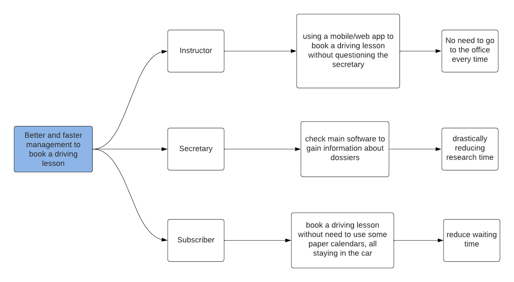
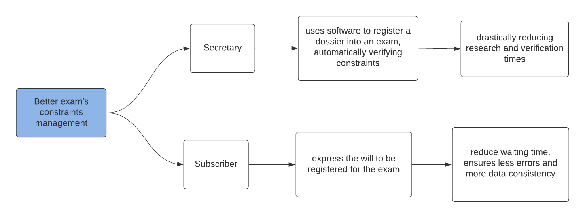

# Obiettivi del progetto
La richiesta del committente ha dato l'inizio al processo di avvio del progetto. Durante questo processo, è stata organizzata una riunione di definizione degli obiettivi, in cui è stato utilizzato il metodo dell'***Impact Mapping*** per identificare gli attori principali coinvolti nel progetto e stabilire l'impatto che le *deliverables* del progetto devono avere, oltre ai *business value* attesi.

Sono stato organizzato anche il processo di *Knowledge Crunching* che include le interviste con gli esperti del dominio.

##  Richiesta committente

"Sono il proprietario di due scuola guida. Dato l'avanzare dei tempi, richiedo un software di back-end che possa gestire i bisogni del settore nel quale opero.
In particolare, ho già proceduto a richiedere la realizzazione del front-end.

Vi sono alcune complessità che il dominio di mia competenza, porta con se, riguardanti la gestione delle guide, degli esami e di tutto ciò che concerne gli iscritti, che frequentano le scuola guida.
Lo scopo sarebbe quello di ottenere un software che possa consentire l'utilizzo distribuito nello spazio di determinate funzioni, un esempio fra tutti: uno dei requisiti sarebbe la prenotazione delle guide mediante ambiente esterno agli uffici.

Allo stato attuale, ogni processo è svolto in modo cartaceo o ultimamente con l'utilizzo di applicativi offline, che non ne consentono l'utilizzo efficace ed efficiente, anche in mobilità.
L'utilizzo di applicativi non unici e offline porta con se ulteriori limitazioni, riguardanti la correttezza e la consistenza dei dati tra i diversi uffici."

## Scenarios
### Impact Map

Successivamente alla richiesta precedentemente illustrata, il team di sviluppo ha deciso di produrre le seguenti impact map, per riuscire a comprendere maggiormente il problema e formulare domande significative nelle successive interviste.

Nelle impact map fornite, il primo livello indica il goal che vogliamo ottenere con la messa in atto del progetto concluso.
Ad esempio: miglior gestione (in termini di velocità e minor inconsistenza dei dati) per le guide.

Il secondo livello mostra gli attori coinvolti per il raggiungimento del goal preposti. Questi possono essere categorizzati in: utenti che interagiscono direttamente sul sistema (Istruttore o Segretario) e Iscritti (attori esterni che interagiscono con utenti del sistema).

Il livello successivo descrive l'impatto del progetto sulle azioni che gli attori andranno a effettuare.
L'ultimo livello individua il *business value* atteso dal raggiungimento degli obiettivi inizialmente individuati.

      
      
[Fig 1] Impact map: gestione delle guide

      
      
[Fig 1] Impact map: utilizzo e coordinamento nell'utilizzo dei veicoli

      
      
[Fig 1] Impact map: gestione degli esami e relativi vincoli

### Goal
Ricapitolando i goal individuati sono:
- **Migliorare la gestione di prenotazione delle guide**. Effetti attesi sono: riduzione degli errori, aumento della velocità e precisione.
- **Migliorare la gestione del parco veicoli**: Rimozione della comunicazione diretta per individuare i veicoli disponibili, prevenzione dei casi quando lo stesso veicolo è stato richiesto due volte per la stessa data e ora.
- **Verifica automatica dei vincoli di business**: Riduzione del tempo richiesto per le verifiche manuali, riduzione degli errori.

### Obiettivi
Per lo sviluppo dell'applicativo è stato scelto l'approccio Domain Driven Design (DDD) perché mette l'accento sull'analisi e la comprensione del dominio aziendale. Utilizzando l'approccio Domain Driven Design, è possibile modellare e rappresentare in modo più accurato concetti di business all'interno dell'applicativo, favorendo una migliore comprensione e una maggiore aderenza alle esigenze del committente.

Gli obbiettivi del progetto sono:

- Sviluppare un sistema back-end basato su microservizi
- Progettare i microservizi utilizzando DDD
- Documentare il dominio del sistema secondo DDD 

## Self-assessment policy
Al fine di garantire il rispetto dei requisiti e il corretto funzionamento delle API fornite dai microservizi, è stato deciso adottate le seguenti misure di quality assurance:
- Gli scenari d'uso descritti dal committente saranno integrate direttamente nel processo di testing attraverso l'utilizzo dell'approccio "Acceptance-Testing Driven Development".
- Saranno implementati processi di Continuous Integration per assicurare che il software venga testato in modo completo negli ambienti di esecuzione "puliti".
- Sarà effettuata una verifica automatica della qualità del codice mediante l'utilizzo di plugin esterni.
